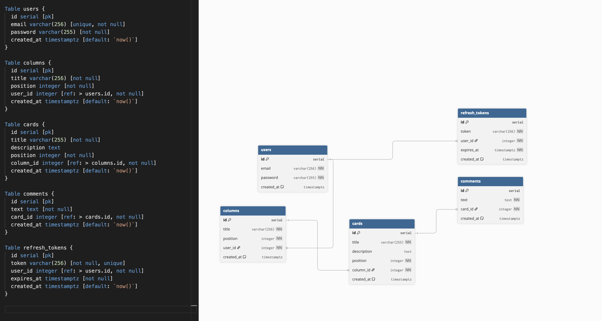

# 🌠 Trello API

**Trello-like REST API built with NestJS**

## 💎 Technologies
- NestJS
- TypeScript
- PostgreSQL
- TypeORM
- Docker

## 🎬 Getting Started

### Installation
```bash
git clone https://github.com/PinGBin74/Test_assignment.git
cd trello-api
```

Create a `.env` file in the `infra` directory with:
```bash
DB_HOST=postgres
DB_PORT=5432
DB_USERNAME=your-db-username
DB_PASSWORD=your-db-password
DB_DATABASE=your-db-database
JWT_SECRET=your-secret-key
```

## Run Server
```bash
cd infra
docker-compose up --build
```

The API will be available at `http://localhost:3000`

## 📚 API Documentation
Once the server is running, visit `http://localhost:3000/api` for interactive Swagger documentation.

## ♾️ Project Structure

### 💡 Modules

- **infra:** Docker and Docker Compose configurations for development
- **src:** NestJS application source code

### 🔑 Key Modules
- **auth:** Authentication & authorization (JWT, Passport strategies)
- **users:** User management
- **columns:** Trello board columns
- **cards:** Trello cards within columns
- **comments:** Card comments
- **entities:** TypeORM database entities

### 🗂️ File Structure
```
src/
├── auth/                 # Authentication module
│   ├── dto/             # Data transfer objects
│   ├── guards/          # JWT & local auth guards
│   ├── strategies/      # Passport strategies
│   ├── auth.controller.ts
│   ├── auth.service.ts
│   └── auth.module.ts
├── users/               # User management
├── columns/             # Board columns
├── cards/               # Trello cards
├── comments/            # Card comments
├── entities/            # Database entities
└── interfaces/          # TypeScript interfaces
```


### 📸 Database diagram

